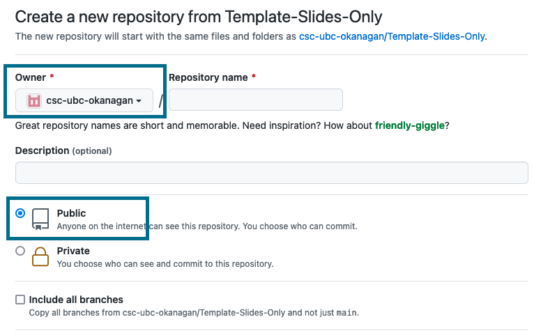
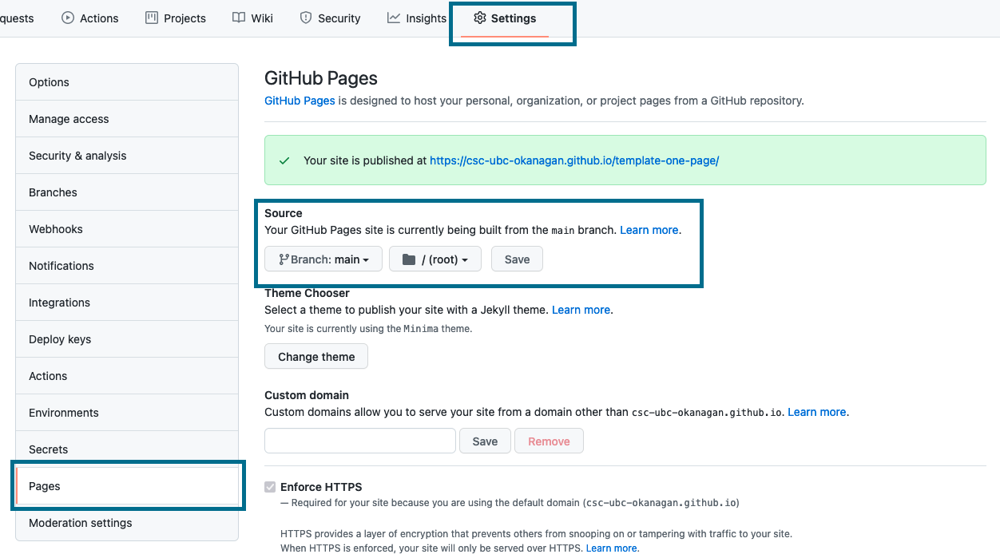

# How to use this template

Seven easy steps...

**First**, copy the template. [Instructions can be found here](https://docs.github.com/en/repositories/creating-and-managing-repositories/creating-a-repository-from-a-template). Don't worry about anything beyond step five. However, ensure that the owner is the CSC and that you set the visibility to `Public`.

**Second**, in your new repository, open the `_config.yml` file and change the title to reflect the name of your workshop.

**Third**, if uploading a slide deck, upload it into the `files` directory. There is a PowerPoint template for the CSC in there already. Once you've uploaded your slide deck, delete the template. If you're slides are being hosted exclusively online, you can delete the template and ignore the `files` directory.

**Fourth**, open the `index.md` file and update the contents. The first line is pulling in the CSC logo, so you can leave that be. There are placeholders for a description and linking files that you've uploaded. Feel free to add anything else you'd like.

**Fifth**, turn your `index.md` file into a GitHub page (note that once you hit save, it could take a few minutes for the content to be live). Go to:
  1. Settings
  2. Pages
  3. Source > main > root
  4. Save

**Sixth**, head over to the [landing page repository](https://github.com/csc-ubc-okanagan/csc-ubc-okanagan.github.io), and update the csv with your workshop title, description and url.

**Seventh**, clean things up. Remove everything from the `_delete` folder. Copy the content from your `index.md` file into here and replace this content with it.
